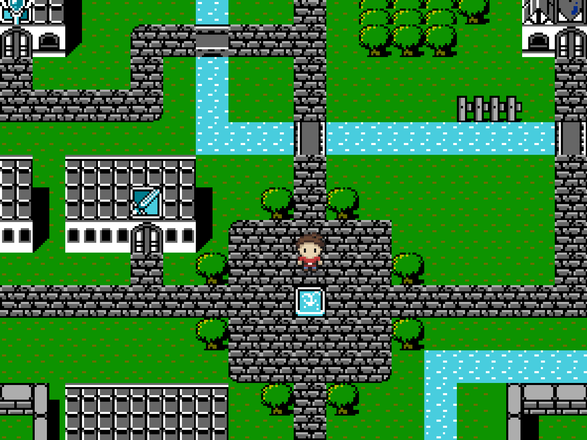
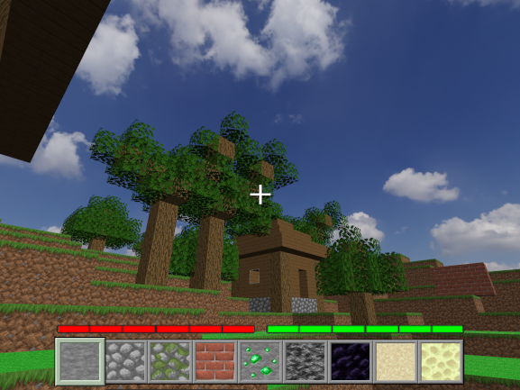

# 👋 Hello there !

## 👤 About me

  <ul>
    <li>
      Recently graduated with a Master's degree in Computer Science, specializing in computer graphics, video games, and interactive simulation
    </li>
    <li>
      I’m passionate about video games and always curious to understand how they work
    </li>
    <li>
      Always looking to learn new programming skills 
    </li>
  </ul>

## 🗃️ My projects

Feel free to dive into my projects and see what I've worked on (click on the examples below to visit my GitHub repositories) :

  

    
    
C++ SDL 2D Engine (WIP)

  

  

    
    
OpenGL Voxel Engine

  

  

    
    
OCaml 2D RPG

  

  

    
    
Image & Video Mosaic Generator

  

  

    
    
Real-time Realistic Ocean Simulation

  

## 💬 Connect with me

  <a href="https://www.linkedin.com/in/loic-kerbaul" style="text-decoration: none; color: inherit;">
    

      
      
loic-kerbaul

    

  </a>

  <a href="mailto:loicker89@gmail.com" style="text-decoration: none; color: inherit;">
    

      
      
loicker89@gmail.com

    

  </a>

