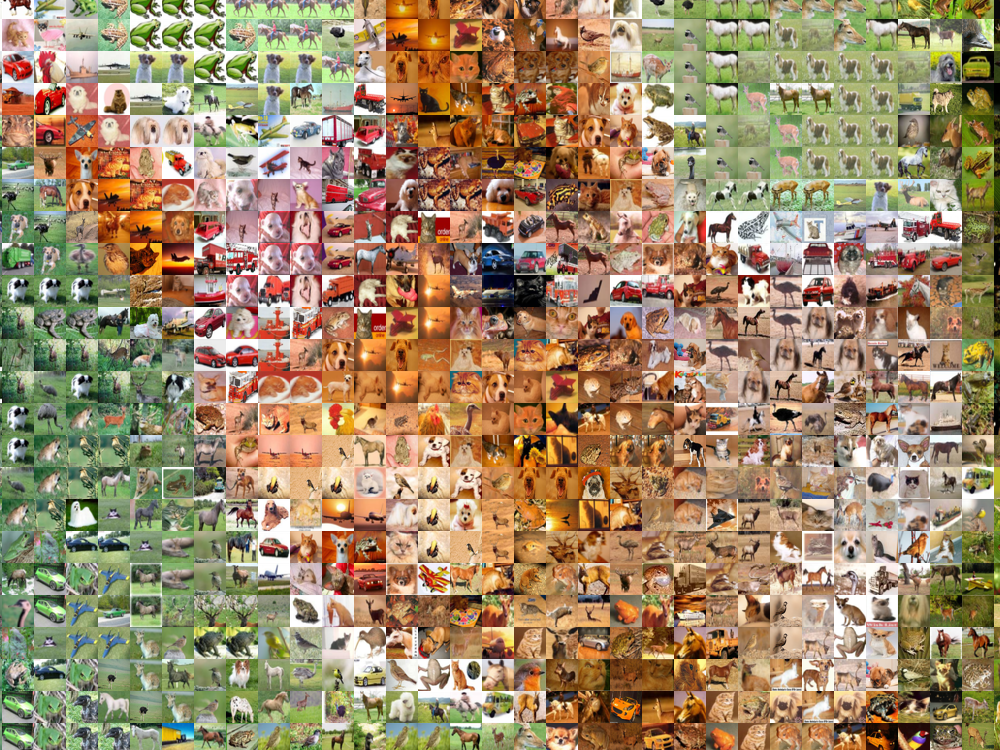
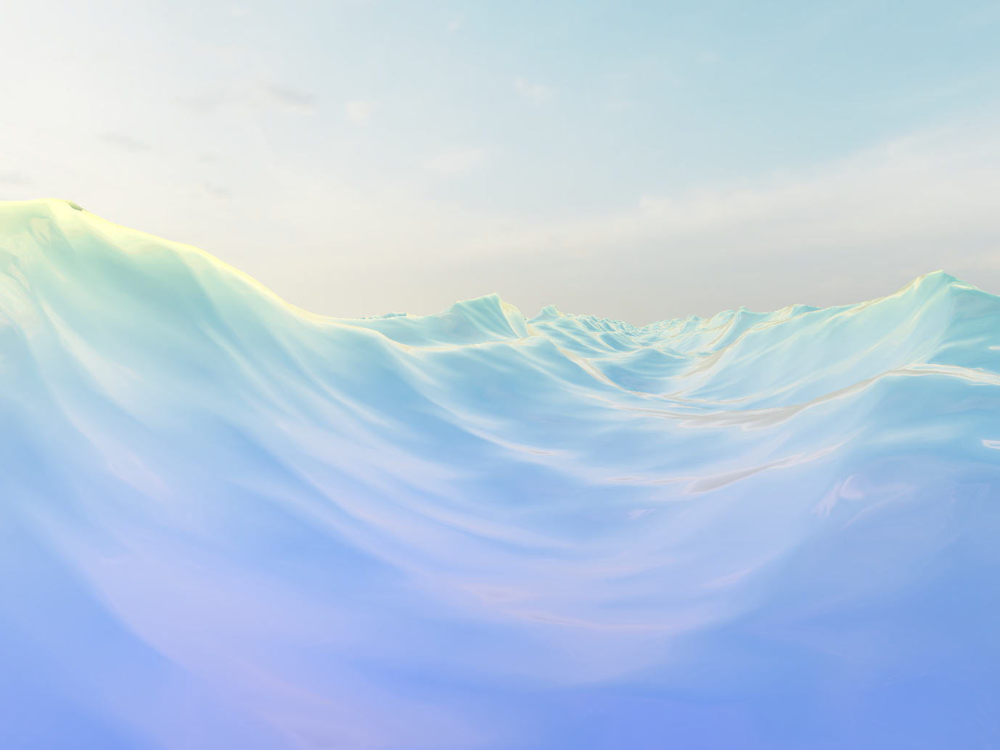
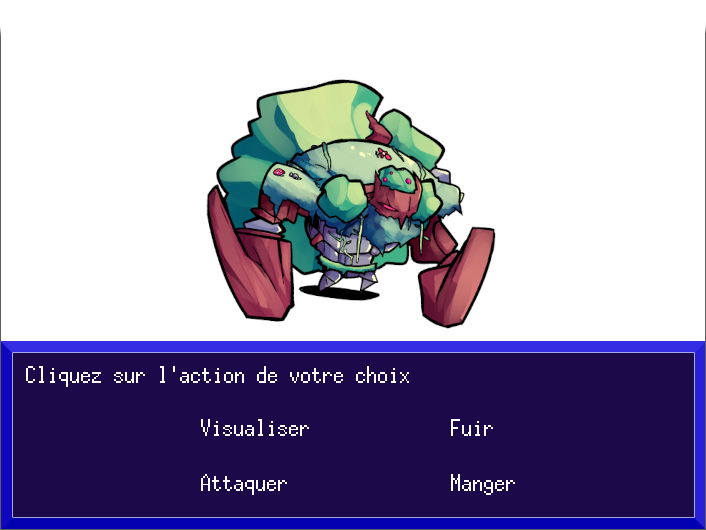

# 👋 Hello there !

## 👤 About me

- <strong>Recently graduated with a Master's degree in Computer Science, specializing in computer graphics, video games, and interactive simulation</strong>
- <strong>I’m passionate about video games and always curious to understand how they work</strong>
- <strong>Always looking to learn new programming skills</strong>

## 🗃️ My projects

<strong>Feel free to dive into my projects and see what I've worked on (click on the examples below to visit my GitHub repositories) :</strong>

<!-- Merge the tables below ?-->
<table align="center">
  <tr>
    <td align="center">
      
       
      <strong>C++ SDL 2D Engine (WIP)</strong>
    </td>
    <td align="center">
      
       
      <strong>OpenGL Voxel Engine</strong>
    </td>
    <td align="center">
      
       
      <strong>Cellular Automata Visualization (WIP)</strong>
    </td>
  </tr>
</table>
<table align="center">
  <tr>
    <td align="center">
      
       
      <strong>Image & Video Mosaic Generator</strong>
    </td>
    <td align="center">
      
       
      <strong>Real-time Realistic Ocean Simulation</strong>
    </td>
    <td align="center">
      
       
      <strong>OCaml 2D RPG</strong>
    </td>
  </tr>
</table>

## 💬 Connect with me

 
   
  &nbsp;&nbsp;&nbsp;
   

